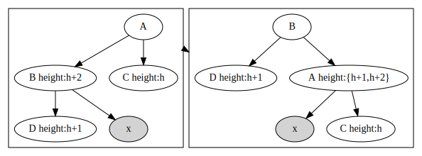

平衡二叉树的是二叉搜索树，树中每个节点的左右孩子高度差不超过1。

### 平衡操作
- 情况1，如果左孩子的高度为h+2, 右孩子的高度为h
    - 左孩子的左孩子高度为h+1，只需要对父亲节点进行有旋操作，如图
    
    - 左孩子的左孩子高度为h,那么如果简单地对父亲节点进行右旋操作，那么
    就会平衡后左右节点的高度差依然大于1，如图所示。所以先对左孩子进行左旋
    操作，保证左孩子的左孩子高度为h+1，如图所示
- 情况2，同理
