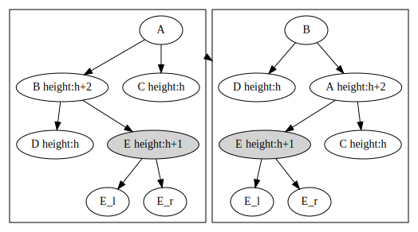
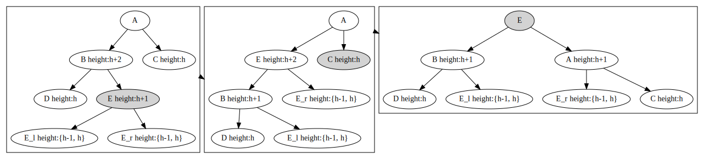

平衡二叉树的是二叉搜索树，树中每个节点的左右孩子高度差不超过1。

### 平衡操作
- 情况1，如果左孩子的高度为h+2, 右孩子的高度为h
    - 左孩子的左孩子高度为h+1，只需要对父亲节点进行有旋操作，如图
      关于x节点的高度情况在{h,h+1}的集合中，经过右旋操作，节点A的高度情况
    为{h+1, h+2}，没有违反关于平衡二叉树的定义
    - 左孩子B的左孩子D高度为h,那么如果简单地对父亲节点进行右旋操作，那么
    就会平衡后左右节点D和A的高度差依然大于1，如图所示。
     所以先对左孩子进行左旋操作，保证左孩子的左孩子高度为h+1,然后再对父亲节点进行右旋操作，如图  这里E_l的高度集合为{h-1,h},
    E_r的高度集合为{h-1,h}，没有违反平衡二叉树的定义。
- 情况2，同理

### 增加操作
先添一个节点，高度为1，查看兄弟节点高度，如果高度差大于1，则将当前节点指向高度大的节点，
然后对当前节点进行平衡操作，然后当前节点指向父亲节点，进入下一个循环，直到根节点
### 删除操作
同理，
### 操作
同二叉查找树
