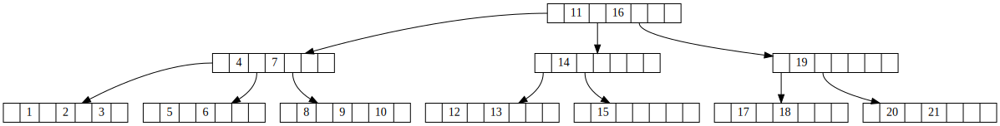

### B-Tree
B-Tree是平衡多叉树，拥有一个平衡因子T,表示一个节点允许拥有的
最大孩子数量，同时，如果一个节点存储的值为n,那么它的孩子数量
为n+1。同时，n的取值范围为{T/2-1, T-1}，如果小于或大于这个
范围，需要对树进行重新平衡，具体表现为节点的分裂和合并。之所以
使用B-Tree而不是红黑树或者别的平衡树，是因为B-Tree用在外存数据库
中，我们知道，数据库的数据容量是非常大的，要为一个数据库建索引，
使用红黑树之类的平衡二叉树在内存成本是不可行的，因此，B-Tree的
逻辑是，只有初始几层的节点是存放在内存中，剩下的每个节点放在
外存中，要查找一个目标值，需要依次从外存中读取一个节点，节点的
大小刚好是一个内存块，查看节点中是否存在目标值，如果不存在，
再从外存中读取下一个节点。

我们知道平衡二叉树的log2(n),那么B-Tree的高度为{log_(t/2-1)(n), log_((t-1)/2)(n)},
其实这个定义并不准确，因为根节点的值数量最小值为1.但可以看出，如果一个节点存储
的值越多，那么它的高度就越小。实际生产环境中，一个节点存储的值
可能多大几千个。B-Tree是严格的平衡二叉树，即每个叶子节点到根节点的
路径长度一样。

B-Tree的定义
- 每个节点有一下性质
    - x.n,表示当前的节点存储值的数量
    - 节点的值是按照递增顺序排列
    - 有叶子节点非叶子节点之分
- 加入一个节点存储n个值，那么它有n+1的孩子，叶子节点没有孩子
- keys表示值递增序列，childs表示节点序列，那么keys[i]>key{childs[i]}
并且keys[i]<key{childs[i+1]}
- 所有叶子节点到根节点的路径长度相等
- 每个节点中值数量在范围内，如果小于或大于这个范围需要重新进行
平衡，包括合并和分裂节点

#### 增
找到符合位置的叶子节点，插入新值，如果值数量超出，分裂出来两个新节点
和一个中间值，中间值插入父亲节点，进入新一轮循环。这里重点的步骤是
分裂节点[下面section](### 分裂节点)

#### 删
找到值所在的节点A，如果此节点不是叶子节点，找到当前节点的下一个节点B,
将节点A的对应值置为节点B[0]。删除叶子节点B的对应值，重新排列B中的值，
如果B中值数量小于最小规定，那么需要进行合并节点操作。

#### 查
可以二分查找，也可以顺序查找。顺序查找，如果节点中含有目标值，
返回当前节点，否则找到第一个比查找值大的小标i，那么目标值可能
在childs[i]的分支中

#### 合并节点
如果兄弟节点值数量大于最小数量要求，可以向父亲节点借一个值，然后父亲节点
再向兄弟节点借一个值，然后将兄弟节点的一个对应孩子调换当前节点上来。
如果兄弟节点值数量仅仅满足最小数量，那么首先将父亲节点的分割值移动队列中，
然后将兄弟节点的值复制到当前节点中，同理，兄弟节点的子节点也移动到当前
节点中，需要注意的是，再移动的时候，如果兄弟节点的孩子不为空，需要将孩子
的父亲指针指向当前节点。这时候父亲节点少了分隔值，需要对值序列进行调整，
同时父亲节点的孩子序列中删除兄弟节点。这时候哦，如果父亲节点的值数量满足
最小要求，那么循环结束，但是，如果不满足最小要求且父亲节点是根节点，那么
也可以结束循环，否则，进入下一个循环。

#### 分裂节点
如果一个节点需要分裂，那么此时它的值数量为T.中间值为mid，那么我们新建两个
节点node1，node2,其中node1含有T/2个值，T/2+1个孩子节点，node2含有T/2-1个值，
T/2个孩子节点。将中间值mid插入父亲节点中，同时将本节点从父亲的孩子序列中
删除，同时插入node1和node2,如果父亲节点值数量大于T-1，那么，进入下一个循环。
如果当前节点为根节点，那么同分裂出了两个新节点，新建一个根节点，删除旧的
跟节点，新根节点插入mid值和node1、node2，结束循环

[代码](./B-Tree.cc)
