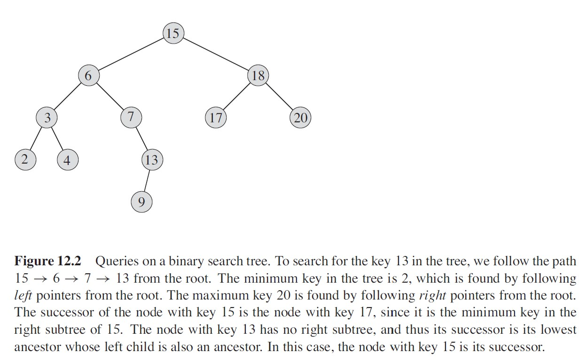

### Binary Search Tree
---------------------------------------------
#### What is Binary Tree?
Binary Search Tree, a data struct which is binary tree and provides features include
`insert`, `delete`, `find`.

#### Definition

- binary tree, whose node's value greater than it's left child val and less than
it's right child vlaue.
