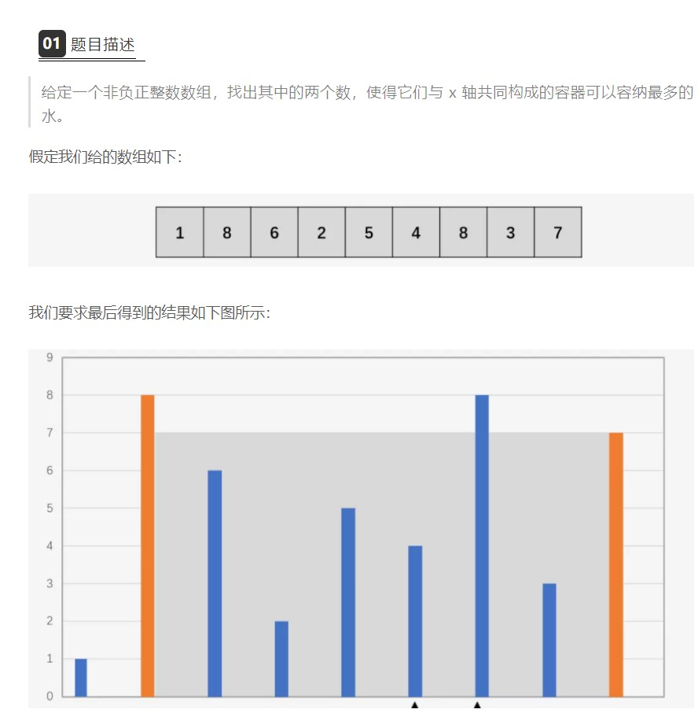

### 双指针和滑动窗口

这里使用双指针的解法。计算两个指针间的值，如果比最大值大，
更新最大值。然后假设[i+1,j]和[i,j-1]中如果存在和比当前最大
值大的区间，那么会在[i+1,j]还是[i,j-1]?这里的条件是list[i]<list[j]
如果存在比当前最大值大的区间，那么一定存在一个值比list[i]要大，
否者，不成立。既然存在比list[i]大的值，那么这个值一定不会和list[i]
发生作用，因为这个值和list[j]的间隔一定比list[j]小，同时计算的方法
又是区间大小乘两个指针中的最小值。基于这一个想法，那么我们可以跳过
list[i]，继续在区间[i+1,j]中寻找最大值，当然并不一定存在。
