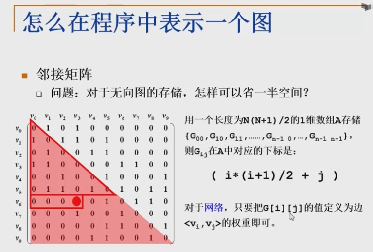
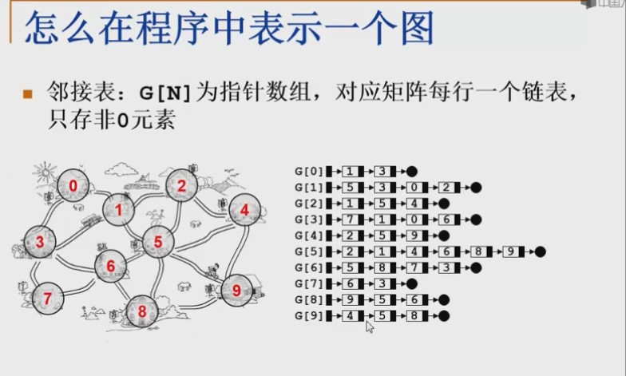
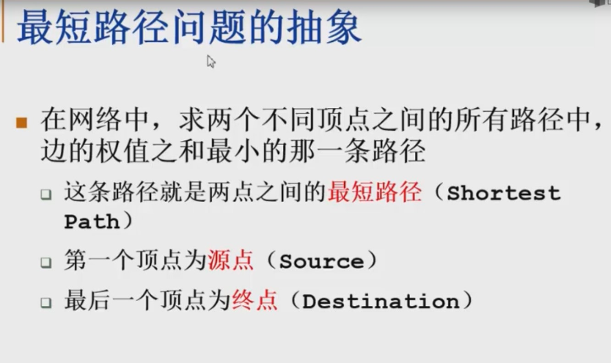
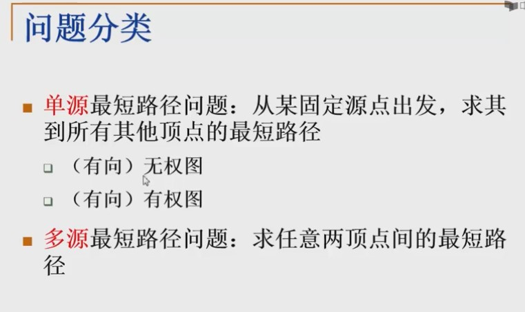

### 怎么在程序中表示一个图
--------
* 邻接矩阵法
    - 用一般的空间来表示图，下标表示为(i*(i+1)/2)+j
    
* 链表法
    - 用一个数组存储所有节点的指针链表，节点中的指针链表表示所有的临边节点
    

### 最短路径问题 shortest path
* 
* 

### 图不连通怎么办
**连通**：如果从v到W存在一条（无向）**路径**，则称v和w是连通的

**路径**：v到W的路径是一系列顶点{v,v1,v2,...,vn,w}的集合，其中任意一堆相邻的顶点
都有图中的边。**路径的长度**
