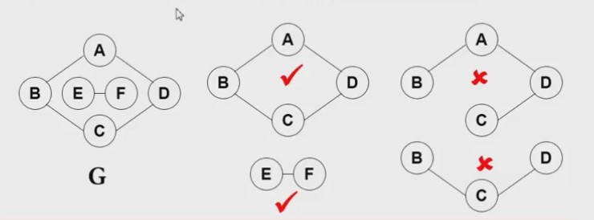
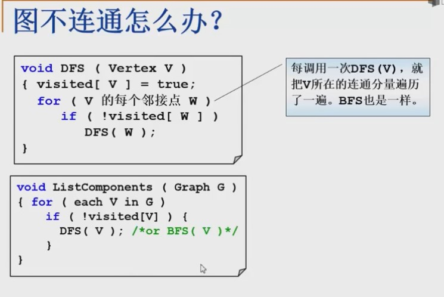
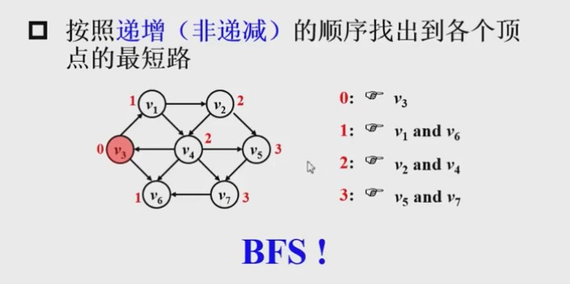
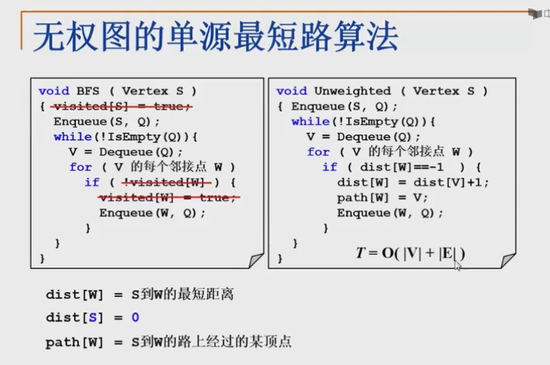
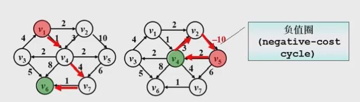
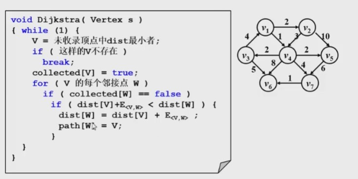

### 怎么在程序中表示一个图
--------
* 邻接矩阵法
    - 用一般的空间来表示图，下标表示为(i*(i+1)/2)+j
    
* 链表法
    - 用一个数组存储所有节点的指针链表，节点中的指针链表表示所有的临边节点
    

### 最短路径问题 shortest path
* 
* 

### 图不连通怎么办
**连通**：如果从v到W存在一条（无向）**路径**，则称v和w是连通的

**路径**：v到W的路径是一系列顶点{v,v1,v2,...,vn,w}的集合，其中任意一对相邻的顶点
都有图中的边。**路径的长度**是路径中的边数（如果带权，则是所有边的权重和）。
如果v到w之间的所有顶点都不同，则称**简单路径**

**回路**:起点等于终点的路径

**连通图**：途中任意两顶点均连通

**如何判断图是不是连通图**: 随机选取一个点，广度优先或者深度优先遍历，判断是不是所有节点
都能遍历到

**判断图中存不存在环**: 并查集/Union Find

**连通分量**：无向图的**极大**连通子图
* **极大顶点数**：再加一个顶点就不连通
* **极大边数**：包含子图中所有顶点相连的所有边
    - 

* **强连通**：有向图中顶点v和w之间存在双向路径，则称v和w是强连通的
* **强连通图**：有向图中任意两顶点均强连通

### 如何遍历不连通图中的所有顶点
-------------------

### 无权图的单源最短路径算法
--------------
* **单源路径**：只存在一个顶点或已经确认顶点的路径
* **可以解决的问题**:james bond从孤岛跳上岸，最少需要跳多少步?
* **使用BFS解决单源最短路径问题**:

* 代码实现

### 有权图的单源最短路径算法 (**dijkstra算法**)
--------------

* 如果边的权重存在负值，那么存在负值圈(negative-cost cycle)问题，这回造成目前
所有的算法失效，因此不讨论存在边权重为负值的情况
* 按照**递增**的顺序找到各个顶点的最短路
* [dijkstra算法](./Dijkstra/README.md)
    - 
    
* 如果边的权重存在负值，那么存在负值圈(negative-cost cycle)问题，这回造成目前

### 生成树/Spanning Tree
一个连通图的生成树是一个极小的连通子图，它包含全部的n个顶点，但只有构成一个棵树的n-1条边。

- 一个连通图可以有多个生成树；
- 一个连通图的所有生成树都包含相同的顶点个数和边数；
- 生成树当中不存在环；
- 移除生成树中的任意一条边都会导致图的不连通， 生成树的边最少特性；
- 在生成树中添加一条边会构成环。
- 对于包含n个顶点的连通图，生成树包含n个顶点和n-1条边；
- 对于包含n个顶点的无向完全图最多包含n^(n-2)颗生成树。

比较有应用价值的是[最小生成树](./Minimum-Spanning-Tree/README.md),就是原图中边的权值最小的生成树 ，所谓最小是指边的权值之和小于或者等于其它生成树的边的权值之和。
