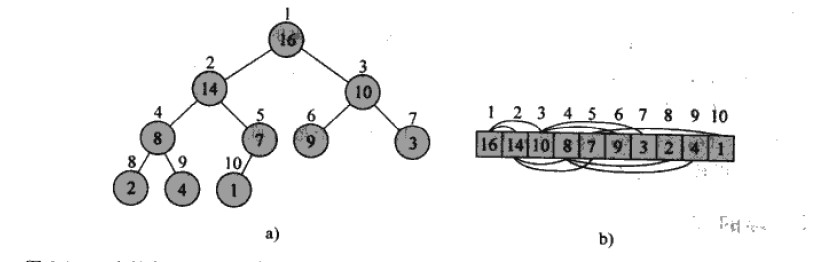

### Heap

- **Definition**
    - Heap is an array
    - if a[i] is root, then a[2*i + 1] and a[2*i+2] are the children of a[i]
    - if Heap is Big Root Heap, then a[i] >= a[2*i + 1] and a[i] >= a[2*i+2]. 
      Otherwise if Heap is Small Root Heap, then a[i] <= a[2*i+1] and a[i] <= a[2*i + 2]

一个最大堆(大根堆)可被看作a)一棵二叉树和b)一个数组。圆圈中的数字表示树中每个结点存储的值，结点上方的数字表示对应的数组下标。数组上下的连线表示父子关系，且父结点总在子结点的左边。这棵树的高度为3，存储值为8的4号结点的高度为1

