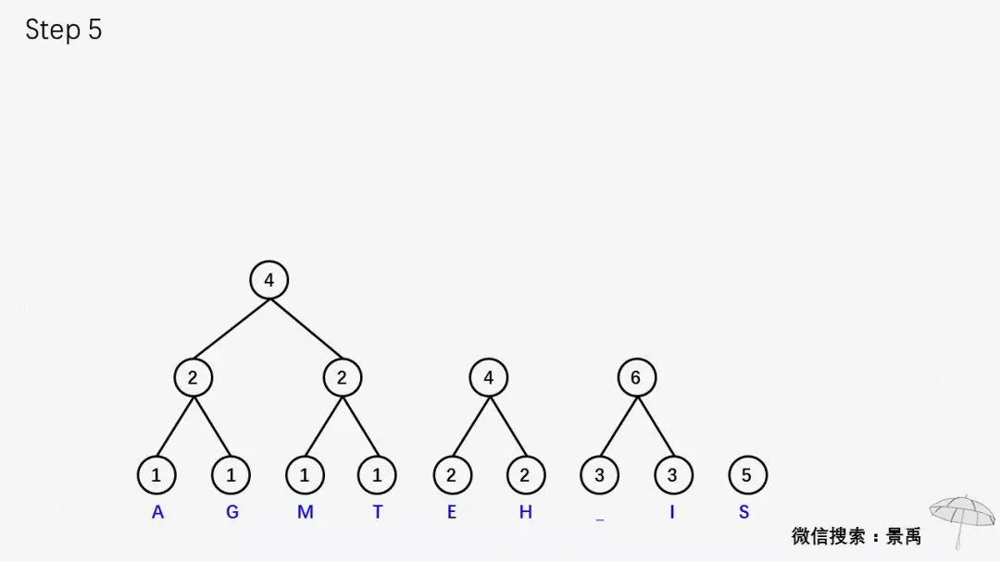

### Huffman Coding/霍夫曼编码
霍夫曼编码是一种基于霍夫曼树的无损压缩算法。而霍夫曼树
是一种前缀树或者字典树的数据结构，其原始数据只保留在
叶子节点中，也就是说树的每一条路径只包含一个原始数据。

要准确的定义什么是霍夫曼树，首先要定义下面几个定义
- 节点的路径长度：从根节点到该节点的路径上的连接数
- 树的路径长度：树中每个叶子节点的路径长度之和
- 节点带权路径长度：节点的路径长度与节点权值的乘积
- 树的带权路径长度：WPL(Weighted Path Length)是树中所有叶子节点的带权路径长度之和

基于以上的定义，那么霍夫曼树的形式化定义就是一种WPL最小的前缀树

构建霍夫曼树的过程
- 统计文件中字节出现的次数，这里的一个字节有8位
- 将字节出现次数的统计表存入有序map中
- 取map中两个权值最小的节点，构建它们的父节点，且他们的父节点的权值是他们权值的和
- map中删去上面两个权值最小的节点，存入他们的父节点
- 进入循环，到步骤3，直到map中再也没有节点

构建霍夫曼树的直观过程

- 基于霍夫曼树的压缩过程: 取文件中的每一个字节，找到树中对应的序列，依次并联，即为加密后的二进制编码
- 基于霍夫曼树的解压过程：依次取文件中的每一位进行前缀树查找，找到到叶子节点路径对应的序列所对应的字节，依次并联，即为解压后的原始数据

如何证明上述的霍夫曼树的构造过程一定会得到一个最小WPL呢，证明过程在[这里](https://opendsa-server.cs.vt.edu/ODSA/Books/CS3/html/HuffProof.html)，总的思路就是用贪心的方法进行归纳证明。
