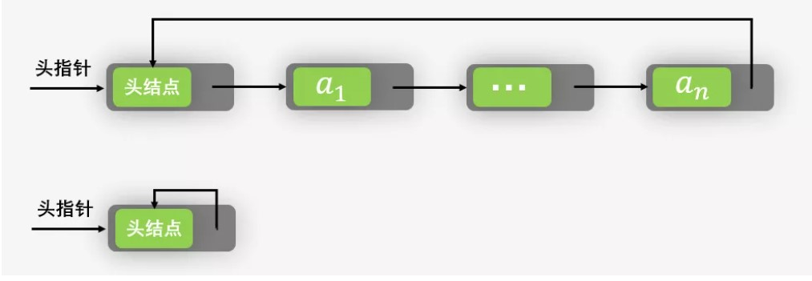

#### 题目：快速找到未知长度单链表的中间结点。

普通方法很简单，首先遍历一遍单链表以确定单链表的长度L。然后再次从头结点出发循环L/2次找到单链表的中间结点。算法的复杂度为：O(L+L/2)=O(3L/2)

利用快慢指针原理：设置两个指针*search、*mid 都是指向单链表的头结点。其中 *search 的移动速度是 *mid的2倍。当*search 指向末尾结点的时候，*mid 正好就在中间了

#### 循环链表

##### 题目: 判断单链表中是否有环
快慢指针法

思路：
- 当慢指针在循环入点时，如果快指针距离慢指针距离为0，那么直接返回
- 当慢指针在循环入点时，如果快指针距离慢指针距离为1，那么再走一步，快慢指针相遇
- 当慢指针在循环入点时，如果快指针距离慢指针距离为2，那么再走一步，快慢指针状态
- 当慢指针在循环入点时，如果快指针距离慢指针距离为3，那么再走一步，快慢指针状态
回到距离为2的状态

经过迭代的过程，可以判断如果存在环，那么快慢指针一定会相遇

