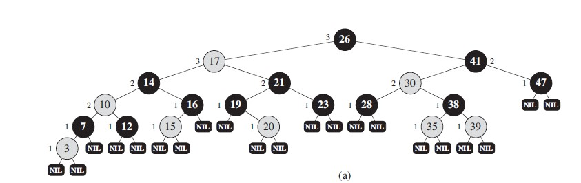

### properties of red-black trees
---------------------
A **red-black** is a binary search tree with one extra bit of storage per node:
its color, which can be either RED or BLACK. By constrainning the node colors
on any simpple path from root to a leaf, red-black trees ensure that no such
path is more than as long as other, so that tree is approximately balancedd.

Each node of the tree contains the attributes color, key, left, right, and parent.
If a cild or the parent of a node does not exist, the corresponding pointer attribute
of the node contains the value NIL.


<center><b>Figure 1</b> An example of a red-black tree</center>

* Every node is either red or black
* The root is black
* Every leaf(NIL) is black
* If a node is red, then both its children are black
* For each node, all simple paths from the node to descendant leaves contain
the same number of black nodes

### RIGHT-ROTATE
```
RIGHT-ROTATE(T, y)
    x = y.left
    y.left = x.right
    if y.left
        y.left.parent = y

    x.right = y
    x.parent = y.parent
    y.parent = x
    if x.parent
        if x.parent.left = y
            x.parent.left = x
        elseif x.parent.right = y
            x.parent.right = x
```

### LEFT-ROTATE
```
LEFT-ROTATE(T, x)
    y =  x.right
    x.right = y.left
    if x.right
        x.right.parent = x
    y.left = x
    y.parent = x.parent
    x.parent = y
    if y.parent 
        if y.parent.left == x
           y.parent.left = y
        elseif y.parent.right == x
            y.parent.right = y
```

### 增
- 同二叉搜索树，在叶子节点添加红色结点，左右子节点为黑色叶子节点
- 循环判断新节点的夫节点是不是红色节点，因为红黑树规定相邻的两个节点不能同是红色
。同时，如果父亲节点是根节点，那么循环判断结束。
- 如果叔父节点为红色，那么将父亲和叔父节点颜色置为黑，将祖父节点颜色置为红色，
当前节点移动到祖父节点
- 如果叔父节点为黑色，那么可以通过左旋或者右旋的方式将当前节点的父亲节点变成黑色
    - 如果自节点、父节点、祖父结点处在同一方向支路上，那么简单左旋后者右旋
    - 如果不在同一方向支路上（比如如果叔父节点是祖父的右节点，那么父亲节点是祖父节点
    的左孩子，自己是父亲节点的左海子。叔父是左孩子同理），需要对父亲节点进行左旋或者右旋
    保证三点在同一方向的支路上
- 结束循环，将根节点置为黑色，因为在将祖父节点置为红色的过程后满足了循环结束的条件
### 删
- 找到需要删除节点，分相面4中情况处理
- 如果删除节点是红色节点且没有孩子，直接删除
- 如果删除节点只有一个孩子，那么删除节点必然是黑色节点，孩子是红色节点，那么仅需要将
孩子节点的值赋在删除节点上，然后删除字节点，不需要做额外调整
- 如果删除节点是黑色节点且没有孩子，那么在删除后需要进行结构调整，因为删除一个黑色节点，
违背了红黑树关于各个支路黑色节点树相同的定义
- 如果删除节点存在左右孩子，那么找到删除节点的继任者（同二叉搜索树的后继者定义），将删除
节点的值换为后继节点的值，然后后继节点成为删除节点，重复前面三个判断步骤

### 删除调整
- 循环判断当前节点不是红色，且当前节点不是根节点，因为循环内的操作需要父节点，根节点没有父节点
- 如果兄弟节点是红色节点，通过左旋或者右旋父亲节点保证当前节点的兄弟节点是黑色节点
- 如果兄弟节点是黑色节点，且兄弟节点的两个孩子是黑色节点，那么将兄弟节点变为红色节点，这样保证了从叶子节点到
当前节点和到兄弟节点的黑色节点数是相同的，即使父亲节点是红色节点，我们在下一步的操作中会将父亲节点变为黑色节点，
从而满足相邻两个节点的颜色不能同为红色的条件
- 如果兄弟节点是黑色节点，且孩子节点中存在一个红色节点。需要保证兄弟的红色孩子节点、兄弟节点、父亲节点在同一个方向的
支路上，然后将兄弟节点的红色孩子节点置为黑色，交换兄弟节点和父亲节点的颜色，然后对父亲节点进行左旋或者右旋，保证删除
节点的支路上新添一个黑色节点，同时兄弟节点的黑色节点数没有发生变化。就可以跳出循环了
- 结束循环后将当前节点的颜色置为黑色，因为跳出循环可能是因为不能满足当前节点是黑色的条件，
将当前节点置为黑色是为了将收删除节点消除影响的支路黑色节点数量
### 查
传统的二叉树查找
