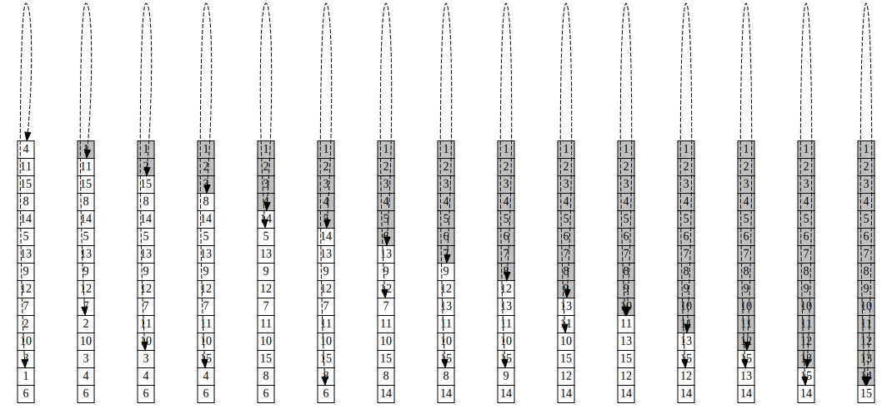
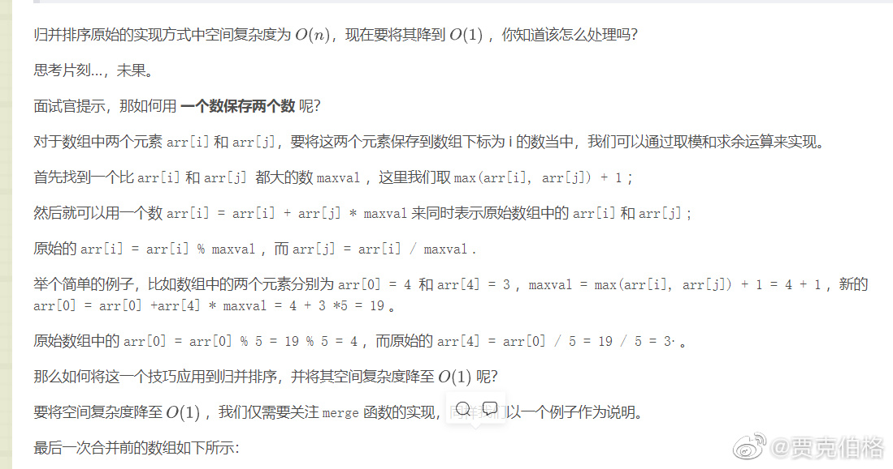
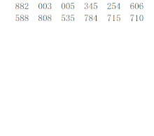
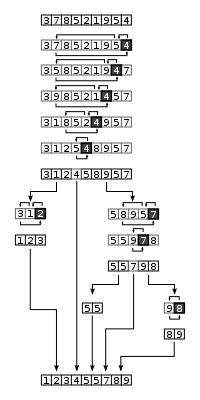

### sort alorithm

#### 选择排序
-------------------------------------------------------
将要排序的数据分成两个部分，一部分是已排序，一部分是未排序，
且已排序的数据全都不大于未排序中任意值。然后选择未排序数据
中最小的值，将它添加到排序数据的末尾。



```
template<typename T, typename F>
void selection_sort(vector<T> &l, F less){
    int n = l.size();
    if(n == 0) return;
    cout<<"digraph{ node [shape=plaintext] edge [style=dashed] "<<endl;
    for(int i=0;i<n;i++){
        int mn = i;
        for(int j=i;j<n;j++){
            if(less(l[j], l[mn])) mn = j;
        }
        traverse(l, i, mn);
        swap(l[i], l[mn]);
    }
    cout<<"}"<<endl;
}
```

#### 冒泡排序
-------------------------------------------------------
遍历数组，如果当前值比下一个值大，则交换这两个值

;

```
template<typename T, typename F>
void bubble_sort(vector<T> &l, F less){
    int n = l.size();
    if(n<2) return ;

    int j=n;
    while(j>1){
        int i=0;
        while(i<j-1){
            if(less(l[i+1], l[i])){
                swap(l[i], l[i+1]);
            }
            i += 1;
        }
        j -= 1;
    }
}

```
#### 插入排序
-------------------------------------------------------
将当前值插入到已排序的数中，已排序数组中的数如果比当前值大，
则往后位移为当前值留出空间。


```
template<typename T, typename F>
void insert_sort(vector<T> &l, F less){
    int n = l.size();
    if(n<2) return;
    int i = -1;
    while(i<n-1){
        int j=i+1;
        while(j>0 and less(l[j], l[j-1])){
            swap(l[j-1], l[j]);
            j -= 1;
        }
        i += 1;
    }
}

```

#### 归并排序
-------------------------------------------------------

归并排序采用分治的思想，将数据按中间下标分为两部分，将
这两部分分别进行排序，排序完成后，再将这两部分进行合并。


```
template<typename T,typename F>
void merge_sort(vector<T> &l, F less, int i, int j){
    if(i>=j) return;
    if(i==j-1){
        if(less(l[j], l[i])) swap(l[i],l[j]);
        return;
    }
    int mid = i+(j-i)/2;
    merge_sort(l, less, i, mid);
    merge_sort(l, less, mid+1, j);
    vector<T> temp = vector<T>(j-i+1);
    int k1 = i;
    int k2 = mid+1;
    int c= 0;
    while(k1<=mid and k2<=j){
        if(less(l[k1], l[k2])){
            temp[c] = l[k1];
            k1 += 1;
            c += 1;
        }else{
            temp[c] = l[k2];
            k2 += 1;
            c += 1;
        }
    }
    while(k1<=mid){
        temp[c] = l[k1];
        k1 +=1;
        c += 1;
    }
    while(k2<=j){
        temp[c] = l[k2];
        k2 += 1;
        c += 1;
    }

    for(int k=i;k<=j;k++){
        l[k] = temp[k-i];
    }
}
```

#### 如何实现空间复杂度为O(1)的归并排序
-------------------------------------------------------

在归并排序算法中使用O(1)空间是不现实的，因为它使用的特殊技巧只适用于整型数组，而且可能在使用乘法的过程中存在数溢出的情况，我们知道，现实中的排序规则复杂而多样，不局限于整型数组。因此花时间去考虑这个问题显然不值得.



#### 堆排序
-------------------------------------------------------

堆分为大根堆和小根堆，我们这里讨论小根堆的情况，因为我们默认采用
正序排序。小根堆，即父节点的值不小于子节点的值的二叉树，可以用
数组实现。堆排序即我们基于要排序的数据建立一颗小根堆，根据小根堆
的性质，它的根节点是所有数中最小的，所以我们每次取根节点的值放入
排序数组中，然后删去根节点，再对小根堆进行调整，具体的调整过程是将
堆最后一个数替代根节点的值，然后从顶向下判断父节点是不是比子节点的
值小，如果小，则父亲节点和子节点值进行互换，知道符合小根堆定义的
状态出现。


```
template<typename T, typename F>
void heap_sort(vector<T> &l, F less){
    int n = l.size();
    if(n<2) return;
    if(n == 2){
        if(less(l[1], l[0])){
            swap(l[0], l[1]);
        }
        return;
    }

    vector<T> heap = vector<T>(n);
    int hn = 1;
    heap[0] = l[0];
    for(int i=1;i<n;i++){
        heap[hn] = l[i];
        hn += 1;
        int j = hn-1;
        int p = (j-1)/2;
        while(j>0 and less(heap[j], heap[p])){
            swap(heap[p], heap[j]);
            j = p;
            p = (j-1)/2;
        }
    }

    int k = 0;
    while(hn>0){
        l[k] = heap[0];
        k += 1;
        heap[0] = heap[hn-1];
        hn -= 1;

        int j = 0;
        while(j<hn){
            int left = j*2+1;
            int right = j*2+2;
            int mn = j;
            if(left<hn and less(heap[left],heap[mn])) mn = left;
            if(right<hn and less(heap[right], heap[mn])) mn = right;

            if(mn == j) break;
            else{
                swap(heap[j], heap[mn]);
                j = mn;
            }
        }
    }
}
```

#### 基数排序
-------------------------------------------------------
基数排序（英语：Radix sort）是一种非比较型整数排序算法，其原理是将整数按位数切割成不同的数字，然后按每个位数分别比较。由于整数也可以表达字符串（比如名字或日期）和特定格式的浮点数，所以基数排序也不是只能使用于整数。基数排序的发明可以追溯到1887年赫尔曼·何乐礼在列表机（Tabulation Machine）上的贡献。

它是这样实现的：将所有待比较数值（正整数）统一为同样的数位长度，数位较短的数前面补零。然后，从最低位开始，依次进行一次排序。这样从最低位排序一直到最高位排序完成以后，数列就变成一个有序序列。

基数排序的方式可以采用LSD（Least significant digital）或MSD（Most significant digital），LSD的排序方式由键值的最右边开始，而MSD则相反，由键值的最左边开始。

- 时间复杂度 O(kN)
- 空间复杂对 O(k+N)



#### 计数排序
-------------------------------------------------------
- 找出待排序的数组中最大和最小的元素
- 统计数组中每个值为i的元素出现的次数，存入数组C的第i项；
- 对所有的计数累加（从C中的第一个元素开始，每一项和前一项相加）；
- 反向填充目标数组：将每个元素i放在新数组的第C(i)项，每放一个元素就将C(i)减去1

当输入的元素是n个0到k之间的整数时，它的运行时间是O(n+k)。计数排序不是比较排序，因此不被nlog(n)的下界限制。


#### 快速排序
-------------------------------------------------------

快速排序的思想是取一个瞄点，每次都将所有小于这个瞄点的
值放在它的左边，所有不小于这个瞄点的值放在它的右边，然后，
数据就分成两部分，再对这两部分数据进行相同的操作，即可。

但是具体实现的过程中需要注意下面几个事项
- 要保重nums[i,j]中所有的数都有跟瞄点进行比较
- 我们可以设置一个flag来表示指针移动方向，一开始，
指针向右移动，如果碰到了比瞄点大的数，则改变移动方向
- 如果向右移动碰到比瞄点大的数，则将改数放在空闲位置，
同时空闲位置变为该数的位置。如果向左移动碰到比瞄点
小的数，则将该数放到空闲位置，同时空闲位置设为该数的位置。
- 我们一开始选择最右边的数为瞄点，同时将最右边的数置为空闲
位置
- 将nums[i,j]中所有的数同瞄点比较后，我们将瞄点的值放在空闲
位置，即nums[empty] = 瞄点值，同时递归处理nums[i,空闲位置-1]和
nums[空闲位置+1, j]中的数据



```
template<typename T, typename F>
void quick_sort(vector<T> &l, F less, int i, int j){
    if(i>=j) return;
    if(i == j-1){
        if(less(l[j], l[i])) swap(l[i], l[j]);
        return;
    }

    int k1 = i;
    int k2  = j;
    int empty = j;
    bool right = true;
    T mark = l[j];
    k2 -=1 ;
    while(k1<=k2){
        if(right){
            while(k1<=k2){
                if(less(mark, l[k1])){
                    l[empty] = l[k1];
                    empty = k1;
                    k1 += 1;
                    break;
                }
                k1 += 1;
            }
            right = false;
        }else{
            while(k1<=k2){
                if(less(l[k2], mark)){
                    l[empty] = l[k2];
                    empty = k2;
                    k2 -=1;
                    break;
                }
                k2 -= 1;
            }
            right = true;
        }
    }
    l[empty] = mark;
    quick_sort(l, less, i, empty-1);
    quick_sort(l, less, empty+1, j);
}
```
